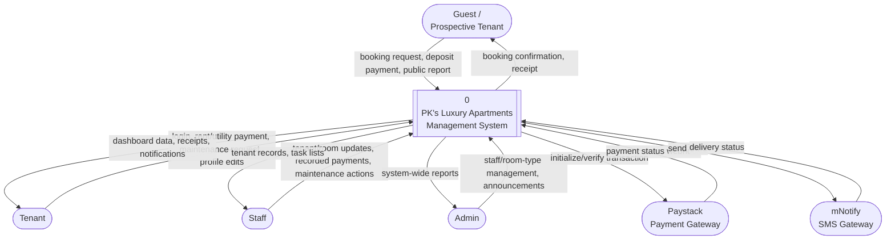
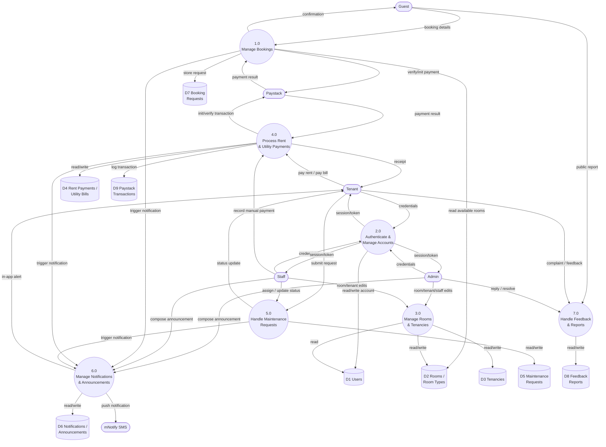
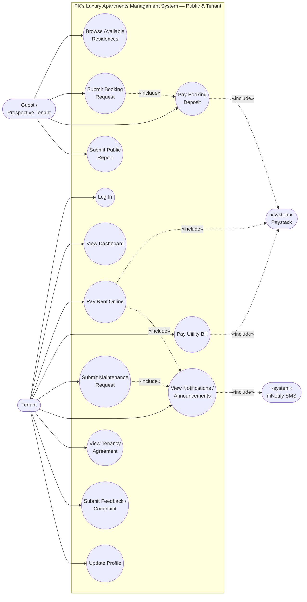
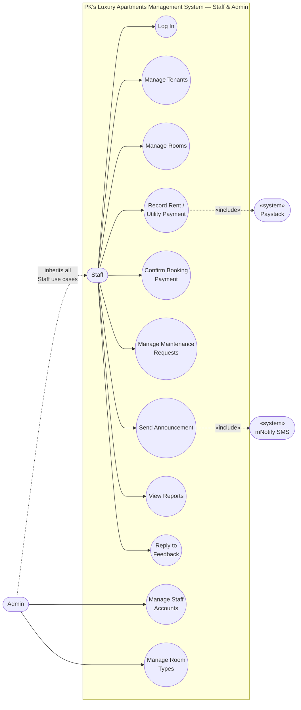

# System Diagrams — PK's Luxury Apartments Management System

Diagram source for this project's Entity-Relationship Diagram (ERD), Data
Flow Diagrams (DFD), and Use Case Diagrams. Everything below is written in
[Mermaid](https://mermaid.js.org) syntax, which renders automatically on
GitHub, GitLab, VS Code (with the Mermaid extension), Notion, and Obsidian
— no image files or extra tools needed. To export a PNG/SVG, paste any code
block into https://mermaid.live.

Reflects the schema in `setup.sql` and the access rules in
`config/database.php` as of this branch.

## Contents

- [1. Entity Relationship Diagram](#1-entity-relationship-diagram)
- [2. Data Flow Diagrams](#2-data-flow-diagrams)
  - [2.1 Level 0 — Context Diagram](#21-level-0--context-diagram)
  - [2.2 Level 1 — Major Processes](#22-level-1--major-processes)
- [3. Use Case Diagrams](#3-use-case-diagrams)
  - [3.1 Public & Tenant](#31-public--tenant)
  - [3.2 Staff & Admin](#32-staff--admin)

---

## 1. Entity Relationship Diagram

```mermaid
erDiagram
    USERS ||--o{ TENANCIES : "rents (as tenant)"
    USERS ||--o{ RENT_PAYMENTS : "pays (as tenant)"
    USERS ||--o{ RENT_PAYMENTS : "records (as staff, received_by)"
    USERS ||--o{ UTILITY_BILLS : "owes (as tenant)"
    USERS ||--o{ MAINTENANCE_REQUESTS : "submits (as tenant)"
    USERS ||--o{ MAINTENANCE_REQUESTS : "is assigned (as staff)"
    USERS ||--o{ NOTIFICATIONS : "receives"
    USERS ||--o{ FEEDBACK_REPORTS : "submits (as tenant, optional)"
    USERS ||--o{ FEEDBACK_REPORTS : "replies (as admin)"
    USERS ||--o{ TENANT_AGREEMENTS : "owns (as tenant)"
    USERS ||--o{ TENANT_AGREEMENTS : "uploads (as staff)"
    USERS ||--o{ ANNOUNCEMENTS : "is targeted (as tenant, optional)"
    USERS ||--o{ ANNOUNCEMENTS : "creates (as admin/staff)"
    USERS ||--o{ RENT_REMINDER_LOG : "is reminded"

    ROOMS ||--o{ TENANCIES : "is assigned in"
    ROOMS ||--o{ RENT_PAYMENTS : "is paid for"
    ROOMS ||--o{ UTILITY_BILLS : "is billed for"
    ROOMS ||--o{ MAINTENANCE_REQUESTS : "is reported for"
    ROOMS ||--o{ ROOM_IMAGES : "has gallery"
    ROOMS |o--o{ BOOKING_REQUESTS : "is requested (optional)"
    ROOM_TYPES ||--o{ ROOMS : "categorizes (by name, app-enforced)"

    USERS {
        int id PK
        varchar username UK
        varchar password "bcrypt hash"
        varchar full_name
        varchar email
        varchar phone
        enum role "admin, staff, tenant"
        varchar profile_picture
        date date_of_birth
        boolean must_change_password
        boolean is_active
        datetime last_login
        timestamp created_at
        timestamp updated_at
    }

    ROOMS {
        int id PK
        varchar room_number UK
        varchar room_type "matches room_types.name"
        int floor
        decimal size_sqm
        decimal rental_price
        enum status "available, occupied, maintenance"
        varchar image
        text description
        text amenities
        timestamp created_at
    }

    ROOM_TYPES {
        int id PK
        varchar name UK
        enum charge_period "monthly, daily"
        timestamp created_at
    }

    TENANCIES {
        int id PK
        int tenant_id FK
        int room_id FK
        date start_date
        date end_date
        decimal monthly_rent
        decimal security_deposit
        enum status "active, expired, terminated"
        timestamp created_at
    }

    RENT_PAYMENTS {
        int id PK
        int tenant_id FK
        int room_id FK
        decimal amount
        date payment_date
        enum payment_method "cash, mobile_money, bank_transfer, cheque, card, ussd, qr, paystack"
        varchar reference_number
        varchar month_covered "YYYY-MM"
        enum status "completed, pending, failed"
        int received_by FK
        text notes
        timestamp created_at
    }

    UTILITY_BILLS {
        int id PK
        int tenant_id FK
        int room_id FK
        enum bill_type "water, electricity"
        decimal amount
        varchar billing_month "YYYY-MM"
        date payment_date
        enum payment_method
        enum status "paid, unpaid, overdue"
        timestamp created_at
    }

    MAINTENANCE_REQUESTS {
        int id PK
        int tenant_id FK
        int room_id FK
        enum category "plumbing, electrical, structural, pest_control, appliance, other"
        varchar subject
        text description
        enum priority "low, medium, high, urgent"
        enum status "submitted, in_progress, resolved, closed"
        int assigned_to FK
        varchar assigned_name
        varchar assigned_phone
        text resolution_notes
        datetime resolved_date
        timestamp created_at
        timestamp updated_at
    }

    NOTIFICATIONS {
        int id PK
        int user_id FK
        varchar title
        text message
        enum type "info, warning, success, payment, maintenance, utility, announcement"
        boolean is_read
        varchar link
        timestamp created_at
    }

    ROOM_IMAGES {
        int id PK
        int room_id FK
        varchar image
        timestamp created_at
    }

    PAYSTACK_TRANSACTIONS {
        int id PK
        varchar reference UK
        varchar pay_type "booking, rent, utility"
        int tenant_id "informational, no FK"
        decimal amount
        int bill_id "informational, no FK"
        varchar month_covered
        timestamp recorded_at
    }

    BOOKING_REQUESTS {
        int id PK
        varchar full_name
        varchar email
        varchar phone
        int room_id FK
        date preferred_date
        text message
        enum payment_type "none, down_payment, full_payment"
        decimal payment_amount
        varchar payment_method
        varchar payment_reference
        enum payment_status "pending, completed, failed"
        varchar verification_code
        enum status "pending, approved, rejected"
        timestamp created_at
    }

    FEEDBACK_REPORTS {
        int id PK
        int user_id FK "nullable, set on submit if logged in"
        varchar reporter_name
        varchar reporter_email
        varchar reporter_phone
        enum category "general, complaint, suggestion, maintenance, feedback, other"
        varchar subject
        text message
        enum status "new, in_progress, resolved, closed"
        text admin_reply
        int admin_reply_by FK
        datetime admin_reply_at
        timestamp created_at
        timestamp updated_at
    }

    TENANT_AGREEMENTS {
        int id PK
        int tenant_id FK
        varchar original_name
        varchar stored_name
        int file_size
        varchar file_type
        int uploaded_by FK
        varchar notes
        timestamp created_at
    }

    ANNOUNCEMENTS {
        int id PK
        varchar title
        text content
        int target_tenant_id FK "null = broadcast to all"
        int created_by FK
        boolean is_active
        timestamp created_at
    }

    RENT_REMINDER_LOG {
        int id PK
        int tenant_id FK
        varchar month_covered
        tinyint week_no
        datetime sent_at
    }
```

**Relationships not enforced as database foreign keys** (shown above for completeness, but validated in application code instead):
- `rooms.room_type` matches `room_types.name` by value — checked against `SELECT name FROM room_types` in `api/rooms.php` rather than a `FOREIGN KEY` constraint, so room types can be renamed without a schema migration.
- `paystack_transactions.tenant_id` / `.bill_id` are used only for idempotency lookups and audit history, not referential integrity.

---

## 2. Data Flow Diagrams

### 2.1 Level 0 — Context Diagram

### 2.2 Level 1 — Major Processes

---

## 3. Use Case Diagrams

Split into two diagrams by actor group — a single combined diagram with all
23 use cases became too dense to read once Mermaid's auto-layout tried to
place four actors and two external systems on the same canvas.

### 3.1 Public & Tenant

### 3.2 Staff & Admin

**Actor notes:**
- **Guest** covers any unauthenticated visitor on the public landing page (`index.php`).
- **Admin** is a generalization of **Staff** — `staff.php` (manage staff accounts) and deleting a feedback report are the only screens gated to `role = 'admin'` specifically (`config/database.php`'s `requireRole()`); every other staff-facing screen accepts both roles.
- Staff and Admin can only log in from a non-mobile user agent (`isMobileUserAgent()` in `config/database.php`) — that gate sits in front of every use case in their diagram, not drawn as a separate use case to keep things readable.
- **Paystack** and **mNotify SMS** are secondary (system) actors: the system calls out to them mid-use-case, they don't initiate anything themselves.
